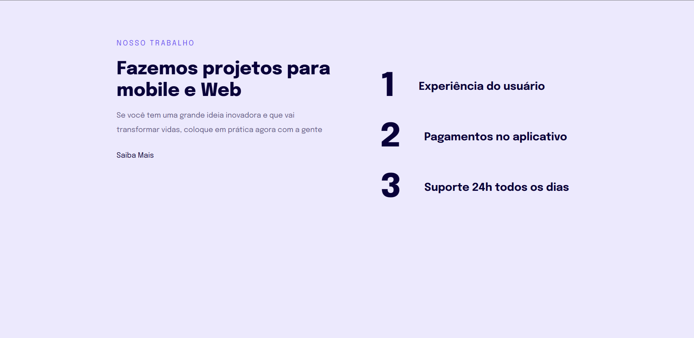

# Introdução à responsividade

[Acesse](https://prdsilva80.github.io/Projeto-04/)

---

## 🛠️ Tecnologias

  

---

## 👨‍🎓 O que aprendi

- Introdução à responsividade
- Regra mobile-first
- Unidades de medidas flexiveis
- Ajustes de textos
- Ajustes da versão mobile
- Versão desktop

---

## 📧 Contato

<a href = "mailto:probertos717@gmail.com">
